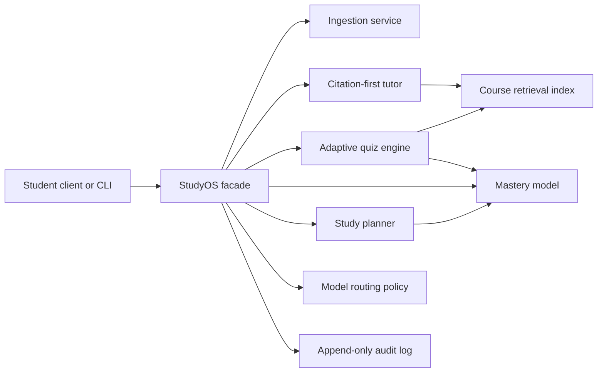

# StudyOS Platform PRD

## Product

StudyOS is a citation-first study platform for college students preparing for
exams. It turns course materials into grounded tutoring, adaptive quizzes,
mastery estimates, and study plans while exposing the operational controls
needed to run AI features responsibly.

## Problem

General chatbots can answer questions, but they do not know the boundaries of a
course, reliably cite lecture materials, adapt practice to demonstrated
weaknesses, or give platform teams visibility into model cost, latency,
fallbacks, and safety events.

## Users

- Student: uploads course material, asks questions, practices, and follows a plan.
- Instructor or reviewer: checks citations, question quality, and progress.
- AI platform team: owns routing policy, auditability, reliability, and release gates.

## Goals

- Answer from course materials with visible citations.
- Generate quizzes tied to retrieved course concepts.
- Update topic mastery from practice outcomes.
- Produce a prioritized study plan from mastery and exam timing.
- Record auditable events for ingestion, tutoring, quizzes, grading, and routing.
- Demonstrate clear service boundaries that can later move behind APIs.

## Non-goals

- Completing graded assignments for students.
- Claiming pedagogical or clinical outcomes.
- Calling a hosted model in the reference implementation.
- Building authentication, billing, or a production document store.

## Core Workflows

1. Create a course and ingest source documents.
2. Ask a question and receive a grounded answer with citations.
3. Generate a quiz from course concepts.
4. Submit answers and update mastery.
5. Generate a study plan prioritized by weak topics.
6. Inspect routing decisions and audit events.

## Architecture

The reference build uses deterministic local implementations behind explicit
interfaces. Hosted models, vector stores, and databases can replace those
implementations without changing the product-facing workflow.

## Principal Engineering Decisions

- Keep orchestration separate from domain services.
- Require citations as part of the tutor response contract.
- Make routing policy explicit and auditable.
- Treat mastery as product state, not model prose.
- Use deterministic fallbacks so learning workflows remain available.
- Keep evaluation in a separate repository to preserve release-gate independence.

## Success Criteria

- Tutor answers always include at least one source citation when evidence exists.
- Quiz results update mastery deterministically.
- Study plans rank weak topics before mastered topics.
- Every core workflow emits an audit event.
- Unit and integration tests run in CI with no hosted dependencies.

