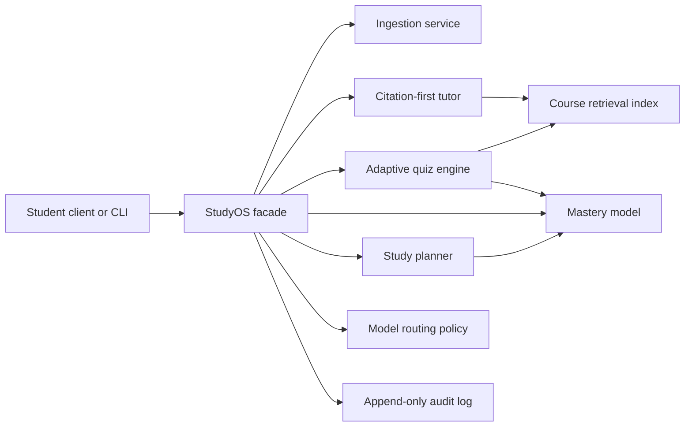

# StudyOS Platform PRD

## Product

StudyOS is a small reference implementation for exploring citation-first study
workflows. It turns supplied text into lexical retrieval results, deterministic
quiz questions, simple mastery estimates, and weak-topic-first study plans.

## Problem

Ungrounded study assistants can answer outside the supplied course material,
and learning-state updates become difficult to reason about when model prose is
treated as product state. This repository makes those boundaries explicit in a
compact implementation.

## Users

- Student: uploads course material, asks questions, practices, and follows a plan.
- Developer or reviewer: inspects citations, quiz contracts, state updates, and
  emitted events.

## Goals

- Answer from course materials with visible citations.
- Generate quizzes tied to retrieved course concepts.
- Update topic mastery from practice outcomes.
- Produce a prioritized study plan from mastery and exam timing.
- Record auditable events for ingestion, tutoring, quizzes, grading, and routing.
- Demonstrate clear service boundaries that can later move behind APIs.

## Non-goals

- Completing graded assignments for students.
- Claiming pedagogical or clinical outcomes.
- Calling a hosted model in the reference implementation.
- Building authentication, billing, or a production document store.
- Claiming the lexical retriever, quiz generator, mastery formula, or study plan
  has been pedagogically validated.
- Providing durable or tamper-resistant audit storage.

## Core Workflows

1. Create a course and ingest source documents.
2. Ask a question and receive a grounded answer with citations.
3. Generate a quiz from course concepts.
4. Submit answers and update mastery.
5. Generate a study plan prioritized by weak topics.
6. Inspect routing decisions and audit events.

## Architecture

The reference build uses deterministic local implementations and an in-memory
facade. A production system would need stronger interfaces and persistence
boundaries before hosted models, vector stores, or databases could be swapped
in safely.

## Principal Engineering Decisions

- Keep orchestration separate from domain services.
- Require citations as part of the tutor response contract.
- Make routing policy explicit and auditable.
- Treat mastery as product state, not model prose.
- Use deterministic fallbacks so learning workflows remain available.
- Keep evaluation in a separate repository to preserve release-gate independence.

## Success Criteria

- Tutor answers include source identifiers when lexical evidence matches.
- Quiz results update mastery deterministically.
- Study plans rank weak topics before mastered topics.
- Every core workflow emits an audit event.
- Unit and integration tests run in CI with no hosted dependencies.
- Re-ingesting one source replaces stale chunks instead of duplicating evidence.
- Only questions issued by the current instance can mutate mastery.
